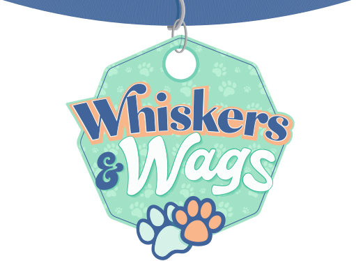

# INFO6150-WebDesign-Project

## Whiskers & Wags 
- Website designed for Pet Adoption

Welcome to **Whiskers&Wags**, a heartwarming pet adoption platform dedicated to connecting loving homes with furry friends in need. Our mission is to facilitate pet adoption and promote responsible pet ownership, ensuring that every animal finds a safe and loving environment.
 

 
## Table of Contents
 
- [INFO6150-WebDesign-Project](#info6150-webdesign-project)
  - [Whiskers \& Wags](#whiskers--wags)
  - [Table of Contents](#table-of-contents)
  - [Project Overview](#project-overview)
    - [Why Pet Adoption?](#why-pet-adoption)
  - [Features](#features)
  - [Tech stack](#tech-stack)
  - [Installation](#installation)
  - [API Endpoints](#api-endpoints)
    - [User Routes](#user-routes)
    - [Pet Listing Routes](#pet-listing-routes)
  - [Group members](#group-members)
 
## Project Overview
 
Whiskers&Wags is designed to make the pet adoption process easy and accessible. Users can browse through various pets available for adoption, learn about their personalities, and find their perfect match. We believe that every pet deserves a second chance, and our platform aims to facilitate this process through user-friendly navigation and engaging content.
 
### Why Pet Adoption?
 
Adopting a pet brings joy, companionship, and unconditional love into your life. By choosing to adopt, you are not only saving a life but also making space for another animal in need. Our website provides resources and information about responsible pet ownership, helping adopters make informed decisions.
 
## Features
 
- **User Authentication**: Users can register and log in to the application. Admins are identified by their email domain (@wwadmin.com).
- **Upload Pet Listings**: Registered users can upload pet listings with details such as name, type, age, breed, sex, color, and image.
- **Like and Comment on Pet Listings**: Users can like and comment on pet listings. Comments include the user's name and comment text.
- **Adopt Pets**: Users can adopt pets, which changes the pet's status to adopted and records the adopting user's details.
- **Admin Approval for Pet Listings**: Admins can approve pet listings raised by registered users.
- **Admin User Management**: Admins can manage the users registered to the system.
 
## Tech stack
- **MongoDB Atlas**: A NoSQL database for storing user and pet data.
- **Express.js**: A web application framework for Node.js, used to build the backend API.
- **React**: A JavaScript library for building user interfaces, used for the frontend of the application.
- **Node.js**: A JavaScript runtime built on Chrome's V8 engine, used to build the backend server.
- **Mongoose**: An ODM (Object Data Modeling) library for MongoDB and Node.js.
- **Axios**: A promise-based HTTP client for the browser and Node.js, used to make API requests from the frontend.
- **Bcrypt**: A library to hash passwords, used to enhance security by storing hashed passwords.
- **Multer**: A middleware for handling multipart/form-data, used for uploading images.

## Installation

1. **Clone the repository**
```
git clone https://github.com/Royniel/INFO6150-WebDesign-Project.git
```

2. **Set up the backend**
```
cd backend
npm install i
```

3. **Set up the frontend**
```
cd frontend
cd whiskerswags
npm install i
```

4. **Configure environment variables:**
Create a .env file in the backend directory and add the following:
```
PORT=5001
MONGO_URI=your_mongodb_connection_string
JWT_SECRET=your_jwt_secret
```

5. **Start the development servers**
```
cd backend
npm start
```

```
cd frontend
cd whiskerswags
npm start
```

6. **Open your browser**
Navigate to `http://localhost:3000` to use the application.


## API Endpoints

### User Routes

- `POST /api/auth/register` - Register a new user
- `POST /api/auth/login` - Log in a user
- `GET /api/users/:id` - Get user details
- `GET /api/users/pets/listed/:id` - Get user's listed pets
- `GET /api/users/pets/liked/:id` - Get user's liked pets
- `GET /api/users/pets/adopted/:id` - Get user's adopted pets

### Pet Listing Routes

- `POST /api/petlisting/upload` - Upload a pet image
- `POST /api/petlisting/add` - Add a new pet listing
- `GET /api/petlisting/unapproved` - Get all unapproved pet listings
- `PUT /api/petlisting/approve/:id` - Approve a pet listing
- `GET /api/petlisting` - Get all pet listings
- `GET /api/petlisting/:id` - Get a pet listing by ID
- `POST /api/petlisting/like/:id` - Like a pet listing
- `POST /api/petlisting/comment/:id` - Add a comment to a pet listing
- `PUT /api/petlisting/adopt/:id` - Adopt a pet
- `DELETE /api/petlisting/:id` - Delete a pet listing


## Group members
- Anusha Gali
- Nilanjan Roy
- Nikita Gupta
- Ashutosh Dwivedi
- Srujan Voodarla