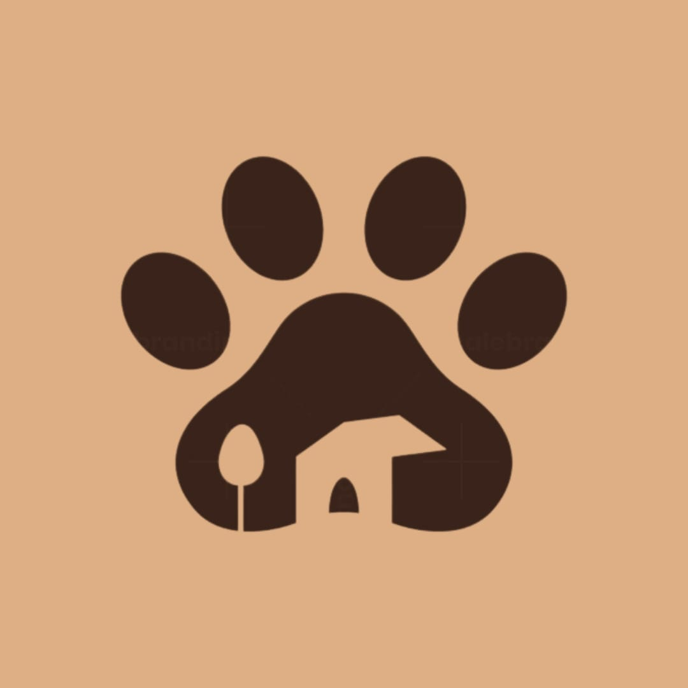

# INFO6150-WebDesign-Project

## Whiskers & Wags 
- Website designed for Pet Adoption

Welcome to **Whiskers&Wags**, a heartwarming pet adoption platform dedicated to connecting loving homes with furry friends in need. Our mission is to facilitate pet adoption and promote responsible pet ownership, ensuring that every animal finds a safe and loving environment.
 

 
## Table of Contents
 
- [INFO6150-WebDesign-Project](#info6150-webdesign-project)
  - [Whiskers \& Wags](#whiskers--wags)
  - [Table of Contents](#table-of-contents)
  - [Project Overview](#project-overview)
    - [Why Pet Adoption?](#why-pet-adoption)
  - [Features](#features)
  - [Project Structure](#project-structure)
  - [Bootstrap Components](#bootstrap-components)
    - [login.html](#loginhtml)
  - [Custom Styling](#custom-styling)
  - [JavaScript Integration](#javascript-integration)
  - [Dependencies](#dependencies)
 
## Project Overview
 
Whiskers&Wags is designed to make the pet adoption process easy and accessible. Users can browse through various pets available for adoption, learn about their personalities, and find their perfect match. We believe that every pet deserves a second chance, and our platform aims to facilitate this process through user-friendly navigation and engaging content.
 
### Why Pet Adoption?
 
Adopting a pet brings joy, companionship, and unconditional love into your life. By choosing to adopt, you are not only saving a life but also making space for another animal in need. Our website provides resources and information about responsible pet ownership, helping adopters make informed decisions.
 
## Features
 
- **User-Friendly Interface**: Easy navigation with clear links to login, signup, and password recovery pages.
- **Responsive Design**: Optimized for mobile and desktop devices using Bootstrap.
- **Pet Profiles**: Detailed information about each pet available for adoption, including images and descriptions.
- **User Authentication**: Secure login and signup process to manage user accounts.
- **Password Recovery**: Simple process for users to recover their passwords if forgotten.
- **Engaging Visuals**: High-quality images of pets to attract potential adopters.
 
## Project Structure
 
The project is organized as follows:
whiskers-wags/
│
├── home.html # Main landing page
├── login.html # User login page
├── signup.html # New user registration page
├── forgetpassword.html # Password recovery page
├── style.css # Custom styles
├── script.js # JavaScript functionality
└── images/ # Directory containing website images
 
## Bootstrap Components

This project extensively utilizes Bootstrap 4.5.2 for a responsive and modern design. Key components include:

### login.html

1. **Container**: Provides a responsive fixed-width container for the login form, ensuring proper alignment on all devices.

2. **Form**: Structures input fields and buttons for user interaction, enhancing usability with built-in validation features.

3. **Form-control**: Applies Bootstrap's custom styles to form inputs for a consistent look across all input fields.

4. **Checkbox**: Used for the "Remember me" option, styled with Bootstrap's default checkbox appearance.

5. **Button**: Styled submit button using Bootstrap's button classes with custom hover effects for better user experience.

6. **Text Utilities**: Classes like `text-purple` and `font-weight-normal` for consistent text styling.

7. **Spacing Utilities**: Margin and padding classes (e.g., `mb-3`) for consistent spacing between elements.

8. **Flexbox Utilities**: Used within the container class for centering the login form vertically and horizontally.

9. **Grid System**: Although not explicitly used in this example, the responsive design is built on Bootstrap's grid system.

10. **Custom Styling**: While not a Bootstrap component, the code demonstrates how to extend Bootstrap's default styles with custom CSS for a unique look.
 
## Custom Styling
 
In addition to Bootstrap’s default styles, we have implemented custom CSS to enhance the visual appeal of the website:
 
- A blur effect on the card background using `backdrop-filter` creates a soft focus effect that draws attention to the content.
- A unique color scheme featuring purple accents (#8a2be2) aligns with our branding while providing visual interest.
- Hover effects on buttons and links enhance interactivity and encourage user engagement.
- A full-screen background image featuring pets adds warmth and character to the site.

- **Carousel Customization**: 
  - Custom positioning and styling of carousel captions for better readability.
  - Responsive design adjustments for carousel elements.

- **Process Section**: 
  - Custom styling for process steps, including responsive image sizing.
  - Box shadow and border effects for a more polished look.

- **Services Section**:
  - Unique layout with a central image and positioned service items.
  - Custom hover effects with overlays for service descriptions.

- **Navbar Enhancements**:
  - Custom purple background for dropdown menus.
  - Hover effects for dropdown items.

- **Footer Design**:
  - Two-tone footer with custom background colors and text styling.
  - Responsive layout adjustments for different screen sizes.

- **Color Scheme**:
  - Consistent use of purple (#8a2be2) as the primary accent color throughout the site.
  - Custom background colors for various sections to improve visual hierarchy.

- **Responsive Design**:
  - Media queries to ensure proper display on various device sizes.
  - Adjustments to image sizes and layouts for mobile responsiveness.

- **Interactive Elements**:
  - Custom hover effects on buttons and links.
  - Transition effects for smoother user interactions.

- **Typography**:
  - Custom font sizes and weights for headings and body text.
  - Text color adjustments for better contrast and readability.

- **Bootstrap Variable Customization**:
  - Modification of Bootstrap's default variables for carousels and popovers to match the site's design.

These custom styles work in conjunction with Bootstrap's components to create a unique and cohesive design that aligns with the Whiskers&Wags brand identity while maintaining responsiveness and accessibility across different devices.
 
## JavaScript Integration
 
The JavaScript file (`script.js`) enhances user experience by providing:
 
- Form validation functionality to ensure users enter valid data before submission.
- Dynamic interactions such as error messages that guide users in filling out forms correctly.
 
## Dependencies
 
This project relies on several key libraries:
*Bootstrap 4.5.2:* For responsive design components.
*jQuery 3.5.1:* For DOM manipulation and event handling.
*Popper.js 2.5.2:* For managing popovers and tooltips in Bootstrap components.